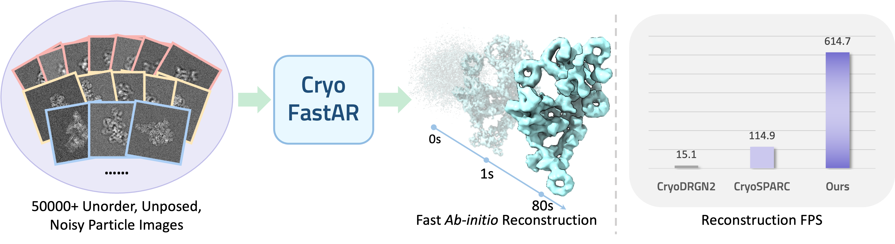

# CryoFastAR: Fast Cryo-EM Ab Initio Reconstruction Made Easy

Accepted by ICCV 2025

[Jiakai Zhang](https://jiakai-zhang.github.io), [Shouchen Zhou](https://scholar.google.com/citations?user=6D6uyxAAAAAJ&hl=en), Haizhao Dai, [Xinhang Liu](https://xinhangliu.com/), [Peihao Wang](https://peihaowang.github.io/), [Zhiwen Fan](https://zhiwenfan.github.io/), [Yuan Pei](https://orcid.org/0000-0003-4065-2540), [Jingyi Yu](https://www.yu-jingyi.com/)

<p align="center">
  
</p>

### This repo is under construction.

### Installation

1. Clone repo

   ```bash
   cd CryoFastAR
   ```
2. create conda envionment and activate

```bash
conda create -n cryofastar python=3.11
conda activate cryofastar
pip install -r requirement.txt
```
